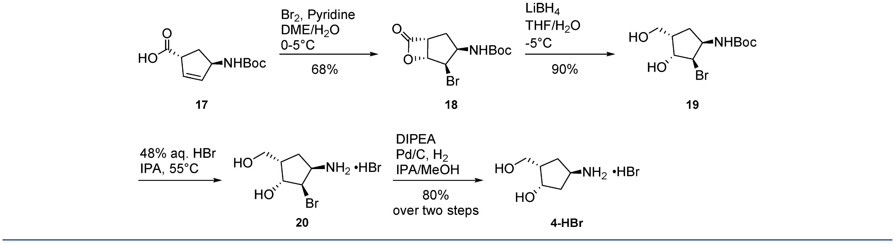
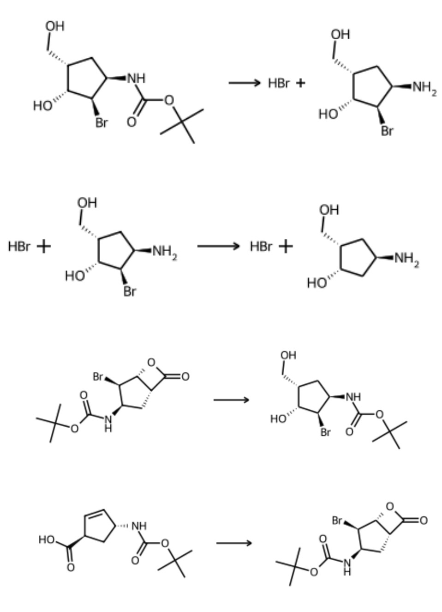
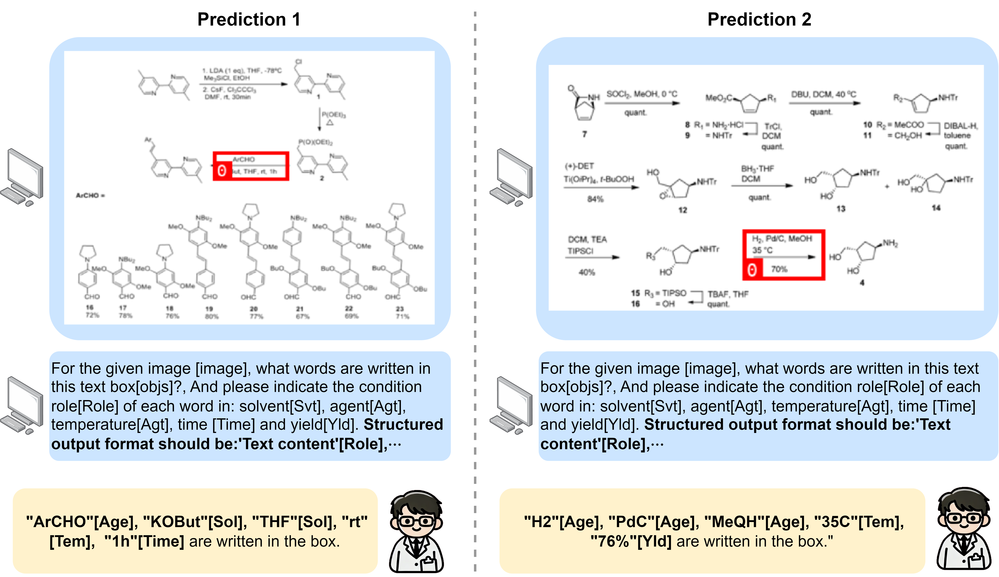

# RxnIM [](https://doi.org/10.5281/zenodo.14673458)
This is the offical code of following paper "Towards Large-scale Chemical Reaction Image Parsing via a Multimodal Large Language Model".

## Highlights
<p align="justify">
In this paper, we present RxnIM, a multimodal large language model for different reaction image data extraction tasks such as reaction extraction task, condition OCR and role identification task. We first formulate these tasks into different task instructions. The model then aligns the task instructions with features extracted from reaction images. An LLM-based decoder can further make predictions based on these instructions. For the reaction extraction task, our model can achieve over 84%-92% soft match F1 score on multiple test sets, which significantly outperforms the previous works. 
The experiments also show the outstanding condition OCR and role identification abilities.
  
[comment]: <> ()

<div align="center">
Overall Architecture of our RxnIM.
</div> 

## Using the code
Please clone the following repositories:
```
git clone https://github.com/CYF2000127/RxnIM
```


## Experiments

### Requirement

1. First create and activate a [conda](https://numdifftools.readthedocs.io/en/stable/how-to/create_virtual_env_with_conda.html) environment with the following command in a Linux, Windows, or MacOS environment (Linux is the most recommended):
```
conda create -n rxnim python=3.10
conda activate rxnim

2. Then Install requirements:
```
pip install -r requirements.txt

### Data preparation
For training and inference, please download the following datasets to your own path.

#### Datasets
1. **Synthetic:**  [Pistachio](https://huggingface.co/datasets/CYF200127/RxnIM/blob/main/reaction_images.zip)
2. **Real:**  [ACS](https://huggingface.co/datasets/CYF200127/RxnIM/blob/main/reaction_images.zip)

#### Data generation
Or use the codes in [`data_generation`](./data_generation) to generate any number of synthetic reaction images.
Note that you should download the original Pistachio dataset first and put it into the same file with the codes.

#### Model
3. Download the model checkpoint from our [Hugging Face Repo](https://huggingface.co/datasets/CYF200127/RxnIM/blob/main/RxnIM-7b.zip) and put in your own path 

### Training
1. Change the dataset path and jasonl file path in [`DEFAULT_TRAIN_DATASET.py`](./config/_base_/dataset/DEFAULT_TRAIN_DATASET.py) for different training stages.
2. Change the parameters in [`shikra_fsdp.py`](config/_base_/train/shikra_fsdp.py) for different training stages according to the paper.
3. Run the following command:
```
sh train.sh
```
 
### Inference
Run the following command:
```
sh eval.sh
```


## Prediction using RxnIM.Web

Go to our [RxnIM.Web demo](https://huggingface.co/spaces/CYF200127/RxnIM) to directly use our tool!

The input is a chemical reaction image 

<div align="center",width="50">
Example input chemical reaction image.
</div> 

The output includes the SMILES of reactants and products, and the detailed condition roles:

``` 
Reaction: 1
Reactants: CC(C)(C)OC(=O)N[C@H]1C=C[C@H](C(=O)O)C1
Conditions: Br2, Pyridine[reagent], DME/H2O[solvent], 0-5°C[temperature], 68%[yield]
Products: CC(C)(C)OC(=O)N[C@@H]1C[C@H]2C(=O)O[C@H]2[C@@H]1Br
Full Reaction: CC(C)(C)OC(=O)N[C@H]1C=C[C@H](C(=O)O)C1>>CC(C)(C)OC(=O)N[C@@H]1C[C@H]2C(=O)O[C@H]2[C@@H]1Br | Br2, Pyridine[reagent], DME/H2O[solvent], 0-5°C[temperature], 68%[yield]

Reaction: 2
Reactants: CC(C)(C)OC(=O)N[C@@H]1C[C@H]2C(=O)O[C@H]2[C@@H]1Br
Conditions: LiBH4[reagent], THF/H2O[solvent], -5°C[temperature], 90%[yield]
Products: CC(C)(C)OC(=O)N[C@@H]1C[C@@H](CO)[C@@H](O)[C@@H]1Br
Full Reaction: CC(C)(C)OC(=O)N[C@@H]1C[C@H]2C(=O)O[C@H]2[C@@H]1Br>>CC(C)(C)OC(=O)N[C@@H]1C[C@@H](CO)[C@@H](O)[C@@H]1Br | LiBH4[reagent], THF/H2O[solvent], -5°C[temperature], 90%[yield]

Reaction: 3
Reactants: CC(C)(C)OC(=O)N[C@@H]1C[C@@H](CO)[C@@H](O)[C@@H]1Br
Conditions: 48% aq. HBr[reagent], IPA[solvent], 55°C[temperature]
Products: Br.N[C@@H]1C[C@@H](CO)[C@@H](O)[C@@H]1Br
Full Reaction: CC(C)(C)OC(=O)N[C@@H]1C[C@@H](CO)[C@@H](O)[C@@H]1Br>>Br.N[C@@H]1C[C@@H](CO)[C@@H](O)[C@@H]1Br | 48% aq. HBr[reagent], IPA[solvent], 55°C[temperature]

Reaction: 4
Reactants: Br.N[C@@H]1C[C@@H](CO)[C@@H](O)[C@@H]1Br
Conditions: DIPEA[reagent], Pd/C, H2[reagent], IPA/MeOH[solvent], 80% over two steps[yield]
Products: Br.N[C@@H]1C[C@@H](CO)[C@@H](O)C1
Full Reaction: Br.N[C@@H]1C[C@@H](CO)[C@@H](O)[C@@H]1Br>>Br.N[C@@H]1C[C@@H](CO)[C@@H](O)C1 | DIPEA[reagent], Pd/C, H2[reagent], IPA/MeOH[solvent], 80% over two steps[yield] 
```

We also provide the source json file output and using Rdkit to visualize the reaction diagram for better inference and usage:


<div align="center",width="50">
Rdkit reaction diagram output
</div> 


## Visualization
We also show some qualitative results of our method below


<div align="center">
visualization examples of the model’s prediction on the reaction component identification task.
</div> 



<div align="center">
Visualization examples of the model’s prediction on the reaction condition interpretation task.
</div> 

 


### Acknowledgement
Our code is based on [Shikra](https://github.com/shikras/shikra) and [VisionLLM](https://github.com/OpenGVLab/VisionLLM), thanks their great jobs!
